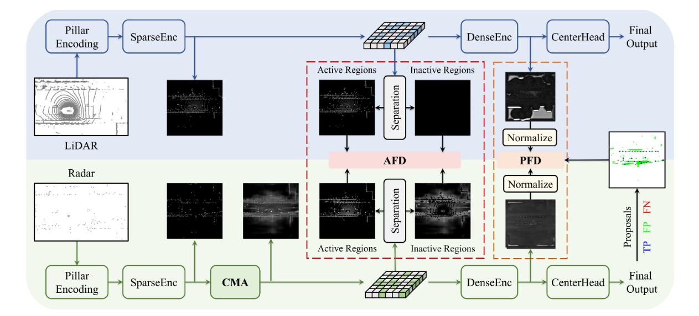

<div align="center">   
  
# RadarDistill: Boosting Radar-based Object Detection Performance via Knowledge Distillation from LiDAR Features
</div>

> - [Paper in arXiv](https://arxiv.org/abs/2403.05061)
> Geonho Bang*, Kwangjin Choi*, Jisong Kim, Dongsuk Kum, Jun Won Choi**


# Abstract
The inherent noisy and sparse characteristics of radar data pose challenges in finding effective representations for 3D object detection. In this paper, we propose RadarDistill, a novel knowledge distillation (KD) method, which can improve the representation of radar data by leveraging LiDAR data. RadarDistill successfully transfers desirable characteristics of LiDAR features into radar features using three key components: Cross-Modality Alignment (CMA), Activation-based Feature Distillation (AFD), and Proposal-based Feature Distillation (PFD). CMA enhances the density of radar features by employing multiple layers of dilation operations, effectively addressing the challenge of inefficient knowledge transfer from LiDAR to radar. AFD selectively transfers knowledge based on regions of the LiDAR features, with a specific focus on areas where activation intensity exceeds a predefined threshold. PFD similarly guides the radar network to selectively mimic features from the LiDAR network within the object proposals. Our comparative analyses conducted on the nuScenes datasets demonstrate that RadarDistill achieves state-of-the-art (SOTA) performance for radar-only object detection task, recording 20.5% in mAP and 43.7% in NDS. Also, RadarDistill significantly improves the performance of the camera-radar fusion model. 


<h1>Methods</h1>


**Overall architecture of RadarDistill**:The input point clouds from each modality are independently processed through Pillar Encoding followed by SparseEnc to extract low-level BEV features. CMA is then employed to densify the low-level BEV features in the radar branch. AFD then identifies active and inactive regions based on both radar and LiDAR features and minimizes their associated distillation losses. Subsequently, PFD conducts knowledge distillation based on proposal-level features obtained from DenseEnc. Note that the LiDAR branch is solely utilized during the training phase to enhance the radar pipeline and is not required during inference.


# Getting Started
Please see [getting_started.md](./docs/GETTING_STARTED.md)

# Generate Initialization Checkpoint
To create the `pillarnet_fullset_init.pth` initialization checkpoint, run the following script:
### **1. Prepare Checkpoints**
Ensure the following files are placed in the `ckpt/` directory:
- [`pillarnet_fullset_lidar.pth`](https://github.com/geonhobang/RadarDistill/releases/download/v0.0.1/pillarnet_fullset_lidar.pth)
### **2. Run the Python Script**
Run the provided script to generate the initialization checkpoint:
```bash
python ckpt.py
```
### **3. Output**
After running the script, the generated initialization checkpoint (`pillarnet_fullset_init.pth`) will be located in the `ckpt/` directory.

---

## **Training & Testing**

This section provides commands to train and evaluate models with RadarDistill. The commands are consistent with the `pcdet` framework and support multi-GPU training and testing.

---

### **Train a Model**

#### **1. Train with Multiple GPUs**
To train a model with multiple GPUs:
```bash
bash scripts/dist_train.sh ${NUM_GPUS} --cfg_file ${CONFIG_FILE} --pretrained_model ${PRETRAINED_MODEL}
```
Example:
```bash
bash scripts/dist_train.sh 4 --cfg_file cfgs/radar_distill/radar_distill_train.yaml --pretrained_model ../ckpt/pillarnet_fullset_init.pth
```

#### **2. Train with a Single GPU**
To train a model with a single GPU:
```bash
python train.py --cfg_file ${CONFIG_FILE} --pretrained_model ${PRETRAINED_MODEL}
```

Example:
```bash
python train.py --cfg_file cfgs/radar_distill/radar_distill_train.yaml --pretrained_model ../ckpt/pillarnet_fullset_init.pth
```
---

### **Test a Model**

#### **1. Test with Multiple GPUs**
To test a model with multiple GPUs:
```bash
bash scripts/dist_test.sh ${NUM_GPUS} --cfg_file ${CONFIG_FILE} --ckpt ${CHECKPOINT_PATH}
```
Example:
```bash
bash scripts/dist_test.sh 4 --cfg_file cfgs/radar_distill/radar_distill_val.yaml --ckpt ../output/radar_distill/ckpt/checkpoint_epoch_40.pth
```

#### **2. Test All Saved Checkpoints**
To test all saved checkpoints for a specific training setting and draw the performance curve on Tensorboard:
```bash
python test.py --cfg_file ${CONFIG_FILE} --batch_size ${BATCH_SIZE} --eval_all
```

#### **3. Test with a Single GPU**
To test a model with a single GPU:
```bash
python test.py --cfg_file ${CONFIG_FILE} --batch_size ${BATCH_SIZE} --ckpt ${CHECKPOINT_PATH}
```

---

### **3. Output**
After running the script, the generated initialization checkpoint (`pillarnet_fullset_init.pth`) will be located in the `ckpt/` directory.

---

## **Training & Testing**

This section provides commands to train and evaluate models with RadarDistill. The commands are consistent with the `pcdet` framework and support multi-GPU training and testing.

---

### **Train a Model**

#### **1. Train with Multiple GPUs**
To train a model with multiple GPUs:
```bash
bash scripts/dist_train.sh ${NUM_GPUS} --cfg_file ${CONFIG_FILE} --pretrained_model ${PRETRAINED_MODEL}
```
Example:
```bash
bash scripts/dist_train.sh 4 --cfg_file cfgs/radar_distill/radar_distill_train.yaml --pretrained_model ../ckpt/pillarnet_fullset_init.pth
```

#### **2. Train with a Single GPU**
To train a model with a single GPU:
```bash
python train.py --cfg_file ${CONFIG_FILE} --pretrained_model ${PRETRAINED_MODEL}
```

Example:
```bash
python train.py --cfg_file cfgs/radar_distill/radar_distill_train.yaml --pretrained_model ../ckpt/pillarnet_fullset_init.pth
```
---

### **Test a Model**

#### **1. Test with Multiple GPUs**
To test a model with multiple GPUs:
```bash
bash scripts/dist_test.sh ${NUM_GPUS} --cfg_file ${CONFIG_FILE} --ckpt ${CHECKPOINT_PATH}
```
Example:
```bash
bash scripts/dist_test.sh 4 --cfg_file cfgs/radar_distill/radar_distill_val.yaml --ckpt ../output/radar_distill/ckpt/checkpoint_epoch_40.pth
```

#### **2. Test All Saved Checkpoints**
To test all saved checkpoints for a specific training setting and draw the performance curve on Tensorboard:
```bash
python test.py --cfg_file ${CONFIG_FILE} --batch_size ${BATCH_SIZE} --eval_all
```

#### **3. Test with a Single GPU**
To test a model with a single GPU:
```bash
python test.py --cfg_file ${CONFIG_FILE} --batch_size ${BATCH_SIZE} --ckpt ${CHECKPOINT_PATH}
```

---

## **Model Zoo**

### **Radar Models**
| Method                          | mAP  | NDS  | Checkpoint                                                                                           |
|---------------------------------|-------|-------|-------------------------------------------------------------------------------------------------------|
| **PillarNet (Radar, student)**  | 8.6  | 34.7  | [Download](https://github.com/geonhobang/RadarDistill/releases/download/v0.0.1/pillarnet_fullset_radar.pth)         |
| **RadarDistill**          | 20.5  | 43.7  | [Download](https://github.com/geonhobang/RadarDistill/releases/download/v0.0.1/radar_distill.pth)                  |


## Acknowledgements
We thank numerous excellent works and open-source codebases:
- [OpenPCDet](https://github.com/open-mmlab/OpenPCDet)
- [CRN](https://github.com/youngskkim/CRN)
- [FG-PFE](https://github.com/konyul/FG-PFE)

# Bibtex
If this work is helpful for your research, please consider citing the following BibTeX entry.

```
@article{bang2024radardistill,
  title={RadarDistill: Boosting Radar-based Object Detection Performance via Knowledge Distillation from LiDAR Features},
  author={Bang, Geonho and Choi, Kwangjin and Kim, Jisong and Kum, Dongsuk and Choi, Jun Won},
  journal={arXiv preprint arXiv:2403.05061},
  year={2024}
}
```
